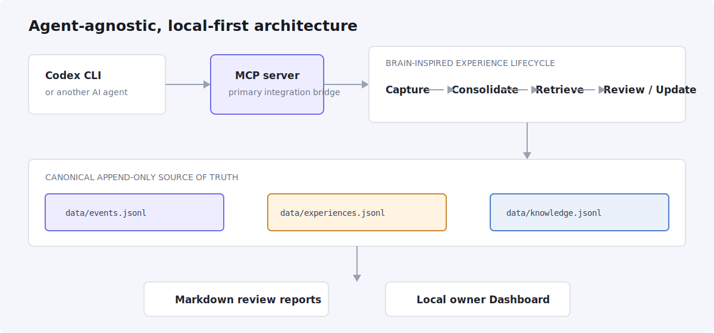
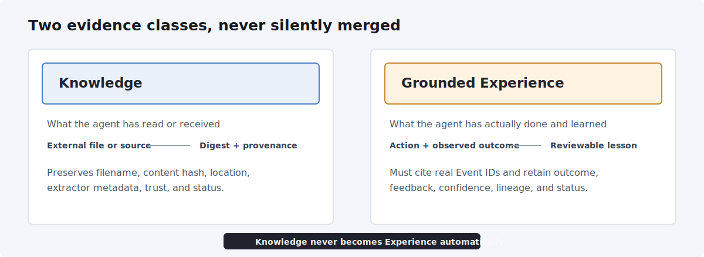
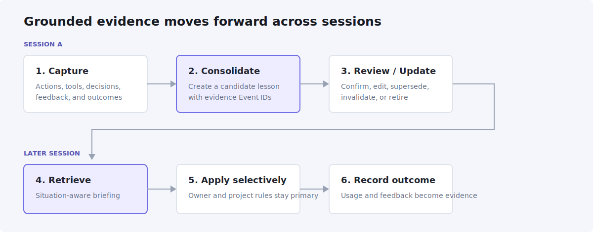
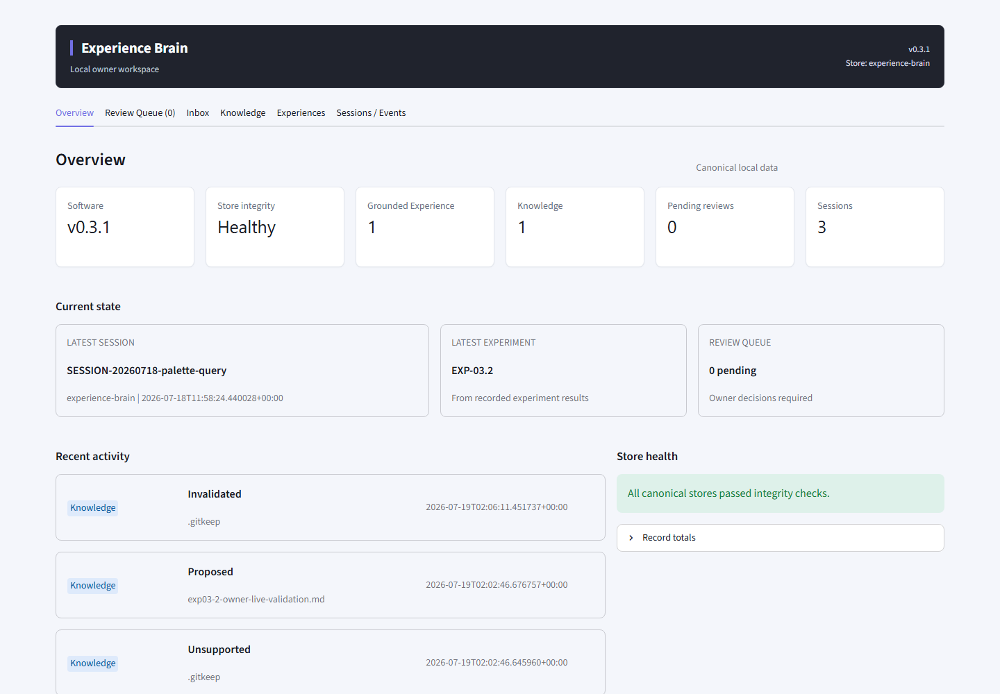
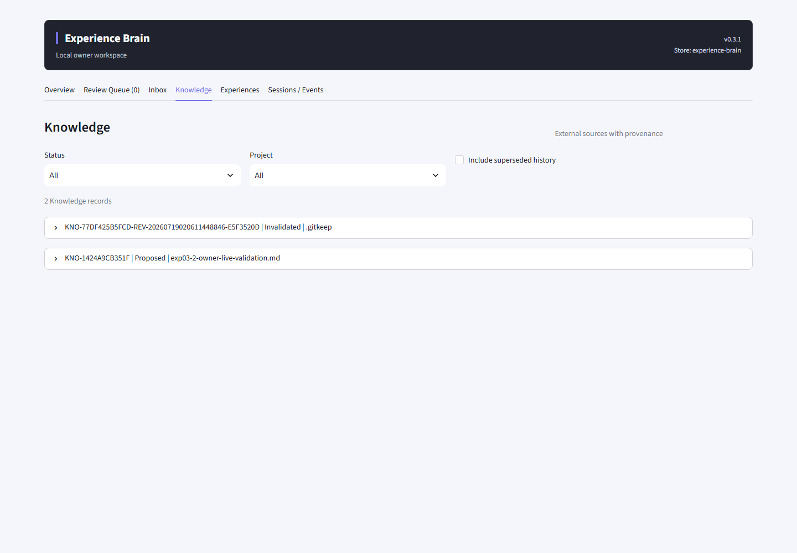
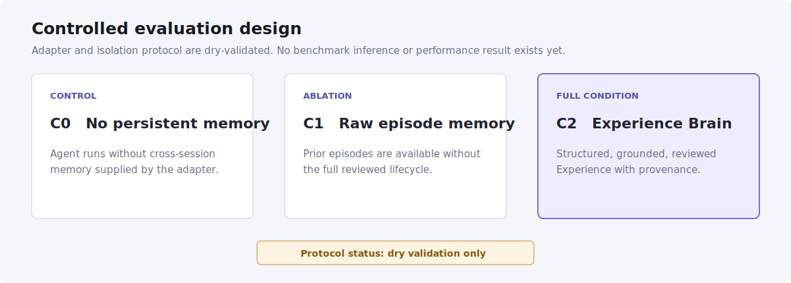

# Experience Brain

<p align="center">
  
</p>

<p align="center">
  
  
  
</p>

**Grounded cross-session experience for AI agents.**

Experience Brain is an open-source, agent-agnostic memory layer that turns grounded
agent episodes into reviewable cross-session Experience while keeping external
Knowledge separate. It is Codex CLI-first, connects through MCP, and uses append-only
JSONL so every derived lesson remains traceable to real events and outcomes.

> Project status: the local POC lifecycle is implemented and validated. The MemoryArena
> integration is dry-validation only; no controlled benchmark result or performance
> improvement claim exists yet.

## Architecture



The canonical source of truth is intentionally small:

```text
data/events.jsonl       what happened
data/experiences.jsonl  lessons grounded in events and outcomes
data/knowledge.jsonl    digests of external sources
```

Records are append-only. A correction creates a new record that supersedes,
invalidates, refines, or retires the earlier record; raw history is not silently
rewritten.

## Knowledge Is Not Experience



| Memory class | Meaning | Required grounding |
| --- | --- | --- |
| **Knowledge** | What the agent has read or received from an external source | Source filename, content hash, location, extractor metadata, and provenance |
| **Grounded Experience** | What the agent has actually done and learned from an observed outcome | Real evidence Event IDs, action, outcome, confidence, provenance, and lifecycle status |

External Knowledge never becomes Experience automatically. It may inform a later
action, but only a grounded episode with an observed outcome can support Experience.

## Experience Lifecycle



```text
Capture -> Consolidate -> Retrieve -> Review / Update
```

Experience is retrieved before a task, around important errors or decisions, and before
final output. Retrieval considers project, situation, tool context, error signature,
outcome, evidence, authority, recency, and source project; it is not treated as keyword
similarity alone.

## What Works Today

- append-only Events, Experiences, and Knowledge with hash-chain integrity checks;
- redaction of secrets, sensitive personal or patient data, leakage-prone content, and
  hidden reasoning before storage;
- session capture, consolidation, Markdown review reports, and evidence-backed review;
- project-aware Experience retrieval and separate Knowledge retrieval;
- Knowledge Inbox for supported text, PDF, DOCX, and XLSX sources;
- Codex-compatible stdio MCP server and fallback Python CLI;
- local single-owner Streamlit Dashboard for review and ingestion;
- isolated MemoryArena adapter and C0/C1/C2 protocol dry validation.

## Quick Start

Requirements: Python `3.11` and a local terminal. Windows PowerShell is the primary
validated environment.

```powershell
py -3.11 -m venv .venv
.\.venv\Scripts\Activate.ps1
python -m pip install --upgrade pip
python -m pip install -e ".[dev]"

experience status
experience dashboard
```

The Dashboard opens locally in a browser. Daily review does not require Python code,
Git, record IDs, or manual JSONL editing.

For macOS or Linux, activate with `source .venv/bin/activate`; the Python core is
cross-platform, while the current owner workflow is validated Windows-first.

## Dashboard

The Dashboard is a local, single-owner interface with six work areas: Overview, Review
Queue, Inbox, Knowledge, Experiences, and Sessions / Events.





See the [Dashboard guide](docs/DASHBOARD_GUIDE.md) for setup, daily review, provenance
inspection, and failure handling.

## Codex And MCP

Install the package, then register the local stdio server:

```powershell
codex mcp add experience-brain -- python -m experience_brain.mcp_server --root .
codex mcp list
```

The MCP server is the primary agent integration bridge. It exposes neutral session,
capture, consolidation, retrieval, Knowledge Inbox, and telemetry tools without
hard-coding a provider or model into the core schema.

See [MCP setup](docs/MCP_SETUP.md) for configuration, isolated stores, the full tool
surface, and troubleshooting.

## CLI

The `experience` CLI is a fallback operational and troubleshooting interface.

| Command | Purpose |
| --- | --- |
| `experience status` | Show software and canonical-store counts |
| `experience dashboard` | Open the local review Dashboard |
| `experience process-session` | Consolidate an incomplete or selected session |
| `experience query` | Retrieve grounded Experience |
| `experience process-inbox` | Extract supported files into Knowledge candidates |
| `experience query-knowledge` | Retrieve external Knowledge |
| `experience query-memory` | Return clearly separated Knowledge and Experience |
| `experience review-latest` | Print the latest Markdown session report |
| `experience lint` | Validate stores, evidence, and hash chains |

The [CLI reference](docs/CLI_REFERENCE.md) documents all public commands, options, safe
examples, and intended audiences.

## No-Code Owner Workflow

Experience Brain is a **low-code setup, no-code daily review and knowledge-ingestion
workflow**:

1. Install the package and configure MCP once.
2. Start Experience Brain and open the Dashboard.
3. Upload supported source files in Inbox and process them as Knowledge.
4. Review candidate Experience in Review Queue.
5. Inspect evidence, provenance, and source lineage when needed.
6. Let the agent retrieve relevant memory in later sessions.

This is not a one-click installer or cloud service. Normal daily operation does not
require editing JSONL, writing Python, using Git, or knowing record IDs in advance.

## Research Evaluation

The planned controlled comparison is:



The adapter, manifests, isolation rules, and smoke protocol have been dry-validated.
No real benchmark inference has been run. Experience Brain therefore makes **no claim
of benchmark improvement**. See [`benchmark-exp/memoryarena/`](benchmark-exp/memoryarena/)
and [EXP-04](experiments/EXP-04-memoryarena-benchmark-integration/README.md).

## ThaiPhaLex Pilot

ThaiPhaLex IS1 is a proposed real-world dogfooding pilot for cross-session research
work. It must use an isolated store and must not contaminate Experience Brain's
development data or any MemoryArena condition store. Pilot observations are
qualitative and operational evidence, not controlled benchmark proof.

See the [ThaiPhaLex pilot protocol](docs/THAIPHALEX_PILOT.md). The pilot is documented
but has not been started by this release.

## Limitations

- retrieval is currently lexical and intentionally has no embeddings or vector database;
- built-in Knowledge digestion is heuristic and provider-agnostic;
- PDFs must contain extractable text; OCR is not implemented;
- the Dashboard is local and single-owner, with no authentication or cloud deployment;
- there is no REST API, knowledge graph, autonomous background agent, or multi-user service;
- benchmark performance remains unmeasured.

## Roadmap

1. **Public Research Preview** - repository, Dashboard UX, documentation, and asset quality.
2. **ThaiPhaLex dogfooding** - isolated operational pilot and failure-mode discovery.
3. **Controlled benchmark** - MemoryArena C0/C1/C2 runs and ablations.
4. **Research paper** - claims only after controlled evidence is available.

See [PRODUCT.md](PRODUCT.md), [PROJECT_PLAN.md](PROJECT_PLAN.md), and the
[experiment index](experiments/INDEX.md) for the current product and research direction.

## Contributing And Security

Contributions are welcome within the current architecture and evidence requirements.
Read [CONTRIBUTING.md](CONTRIBUTING.md) before opening a change. Report vulnerabilities
privately as described in [SECURITY.md](SECURITY.md); do not include secrets, patient
data, or benchmark solutions in a public issue.

## Citation

Use the repository metadata in [CITATION.cff](CITATION.cff). Until a paper or DOI exists,
cite the software repository and the exact version or commit used.

## License

Copyright 2026 Experience Brain contributors.

Licensed under the [Apache License 2.0](LICENSE). The repository does not currently
define a separate trademark policy.
